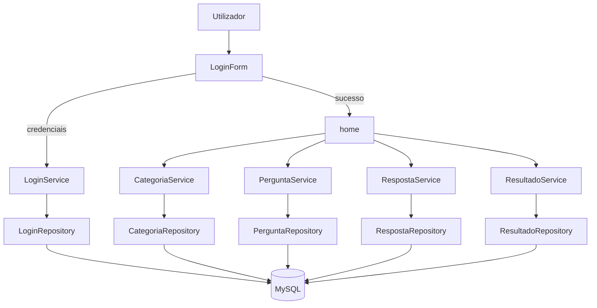

**Projeto:** Quiz de Conhecimentos Gerais (UFCD 1790)  
**Curso/UFCD:** UFCD 1790  
**Tecnologia principal:** C# com Windows Forms (.NET Framework 4.8)  
**Repositório:** `ProjetoUFCD1790`  
**Data:** Abril de 2026

---

# 2. Introdução

## a) Objetivos do trabalho e enquadramento

Este projeto tem como objetivo desenvolver uma aplicação de **quiz** com autenticação de utilizadores, seleção de categoria e registo de resultados. O foco é aplicar conceitos de desenvolvimento desktop com **arquitetura por camadas** (Formulários, Serviços, Repositórios e Modelos), acesso a base de dados MySQL e organização de código em componentes reutilizáveis.

Do ponto de vista teórico, o sistema segue uma estrutura comum em aplicações empresariais:
- **Camada de apresentação (Forms):** interação com o utilizador;
- **Camada de serviço (Service):** regras de negócio;
- **Camada de dados (Data/Repository):** comunicação com a base de dados;
- **Camada de modelo (Model):** entidades que representam dados do domínio.

Lendo esta introdução e as conclusões, é possível perceber o propósito do trabalho: construir uma solução funcional, organizada e extensível para avaliação de conhecimentos por categorias.

---

# 3. Corpo do relatório

## a) Materiais, softwares, linguagens e plataformas

### Linguagens e frameworks
- **C#**
- **.NET Framework 4.8**
- **Windows Forms**

### Base de dados e bibliotecas
- **MySQL** (via `MySql.Data`)
- Pacotes NuGet de suporte (serialização, buffers, compressão, etc.)

### Ferramentas de desenvolvimento
- Visual Studio (compatível com projetos .NET Framework)
- Git para controlo de versões

## b) Esquema / fluxograma / diagrama da arquitetura



## c) Fases do projeto e justificações das opções

### Fase 1 — Estruturação da solução
- Criação da solução `ProjetoUFCD1790.sln` e do projeto Windows Forms.
- Separação por pastas (`Forms`, `Service`, `Data`, `Model`, `Utils`) para facilitar manutenção e evolução.

**Justificação:** reduz acoplamento e melhora legibilidade do código.

### Fase 2 — Autenticação
- Implementação do `LoginForm` como ponto de entrada da aplicação.
- Validação das credenciais com `LoginService` e `LoginRepository`.
- Gestão de sessão com `Sessao`.

**Justificação:** centralizar autenticação e garantir controlo de acesso antes do quiz.

### Fase 3 — Fluxo principal do quiz
- Ecrã `home` com seleção de categorias.
- Carregamento dinâmico de perguntas e respostas.
- Navegação entre perguntas (anterior/próxima) e armazenamento da resposta selecionada.

**Justificação:** melhorar experiência de utilização com navegação clara e estado persistente durante o questionário.

### Fase 4 — Resultados e perfis
- Cálculo e registo de resultados via `ResultadoService`.
- Distinção de perfil de utilizador (admin/user) para controlo de funcionalidades.

**Justificação:** permitir avaliação final e gestão diferenciada de funcionalidades.

### Exemplo resumido de bloco de código utilizado

```csharp
// Fluxo de login
var login = loginService.validarLogin(txt_user.Text.Trim(), txt_pass.Text.Trim());

if (login != null)
{
    LoginService.sessaoLogin(login.Id, login.Usuario);
    GerirForms.TrocarForms(this, new home());
}
```

---

# 4. Conclusões

## a) Auto-crítica e aspetos mais relevantes

O projeto cumpre o objetivo principal de disponibilizar um quiz com autenticação e registo de resultados, aplicando uma arquitetura organizada em camadas e boas práticas de separação de responsabilidades.

**Aspetos positivos:**
- Estrutura modular e fácil de compreender;
- Integração com base de dados para dados dinâmicos;
- Interface funcional para execução completa do quiz.

**Pontos a melhorar (auto-crítica):**
- Reforçar tratamento de erros e mensagens de exceção;
- Aumentar cobertura de testes automatizados;
- Melhorar design visual e responsividade dos formulários;
- Documentar melhor scripts de criação da base de dados.

Em síntese, trata-se de uma base sólida para evolução futura, nomeadamente com novas categorias, ranking, histórico detalhado e melhorias de UX.

---

# 5. Bibliografia e Webgrafia

## a) Fontes de documentação/informação

- Documentação oficial Microsoft Learn (C#, .NET e Windows Forms):  
  https://learn.microsoft.com/
- Documentação oficial MySQL:  
  https://dev.mysql.com/doc/
- Documentação do conector MySQL para .NET (`MySql.Data`):  
  https://www.nuget.org/packages/MySql.Data
- Materiais de apoio da UFCD (apontamentos, exercícios e enunciados fornecidos em aula).

---

# 6. Anexos

## a) Documentação adicional utilizada no projeto

Sugestão de anexos a incluir (em pasta `docs/anexos/`, se aplicável):
- Catálogos/folhetos em PDF utilizados como referência;
- Diagramas adicionais (UML, DER da base de dados, fluxos detalhados);
- Capturas de ecrã da aplicação em execução;
- Scripts SQL de criação/população da base de dados.

> Nota: caso os anexos ainda não estejam no repositório, devem ser adicionados numa iteração seguinte para completar formalmente o relatório.
